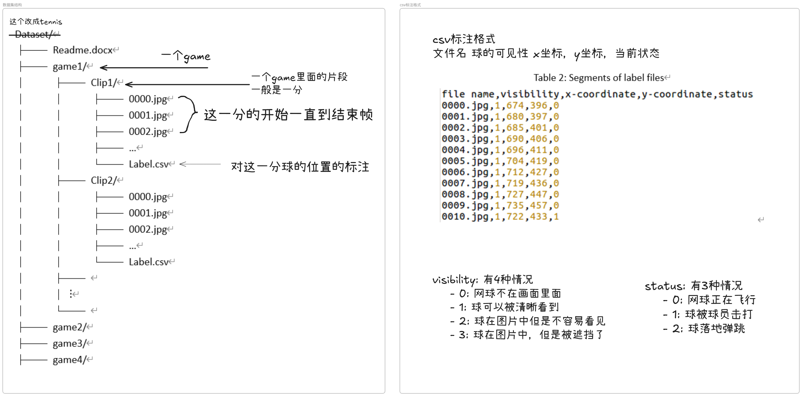
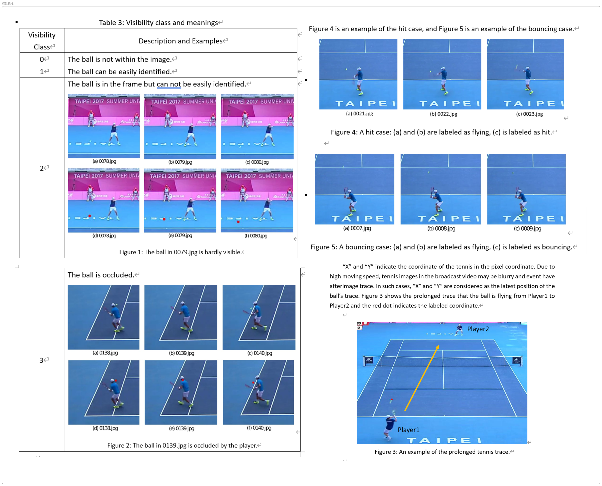

# WASB-TrainingOK

这里是WASB的训练实现代码，由于原论文没有公开训练代码，所以我自己手搓了一个，在自己实现训练代码的过程中我主要解决了如下问题：
- dockerfile，解决镜像软件源连接问题
- `src/configs/dataset/tennis.yaml`， 修改数据集指向路径：`/root/datasets -> /root/src/datasets。` 解决源代码训练路径错误问题
- 在 `src/configs/dataloader.yaml` 明确：`train: True`，解决源代码训练时每个 `epoch 0it、loss=0`的问题
- 修改`src/losses/heatmap.py`, 对 MSE 按尺度逐个计算并累加；其他损失保持字典输入 ，解决源代码损失函数类型不匹配导致训练中断的问题
- 修改`src/runners/runner_utils.py`，将`src/runners/runner_utils.py` 取 `batch_size = next(iter(preds.values())).size(0)`；并 `imgs = imgs.to(device)`。解决 源代码`preds[0]` 报错,潜在设备不一致,批大小获取方式错误/数据不在设备上等问题

下面是我调通之后的开启训练过程，直接按照我下面步骤执行即可开始训练。
# 1. 环境搭建

克隆仓库并构建镜像
```sh
git clone https://github.com/codelancera-offical/WASB-TrainingOK.git
cd WASB-TrainingOK
docker built -t wasb:1.0 .
```

# 2. 准备数据集

## 使用Tracknet的tennis数据集

[在这儿下载数据集](https://nycu1-my.sharepoint.com/:u:/g/personal/tik_m365_nycu_edu_tw/ETCr6-M0e1VDhGCdMbvljcsBu31AJTO5xa_1cW8pHa7niA?e=55tLJ9) 然后把它重命名为tennis放到src/datasets目录下，具体结构如下所示：

```python
    datasets
    |-----soccer
    |        └-----videos
    |        └-----frames
    |        └-----annos
    └-----tennis /* renamed from Dataset */
    |        └-----game1
    |        └-----...
    |        └-----game10
    └-----badminton 
    |        └-----match1
    |        └-----...
    |        └-----match26
    |        └-----test_match1
    |        └-----...
    |        └-----test_match3
    └-----volleyball
    |        └-----videos
    |        └-----volleyball_ball_annotation
    └-----basketball /* renamed from NBA_data */
    |        └-----videos
    |        └-----ball-annos
    |
    src
```


# 3. 启动容器

- 这里我指定共享内存为8g，要是你内存多随便造。
- \<到WASB所在文件夹的路径\> 得你自己改好
```sh
docker run --gpus all --shm-size=8g -d -v <到WASB所在文件夹的路径>\WASB-SBDT\src:/root/src --name wasb-container wasb:1.0 tail -f /dev/null

docker exec -it wasb-container bash
```

# 4. 开启训练

```python
python3 main.py --config-name=train dataset=tennis
```


# 5. 使用自己定义数据集（网球）
你可以直接把你的数据集按照game的单位打包，然后替换或者追加到tennis中，保证符合如下格式即可：


